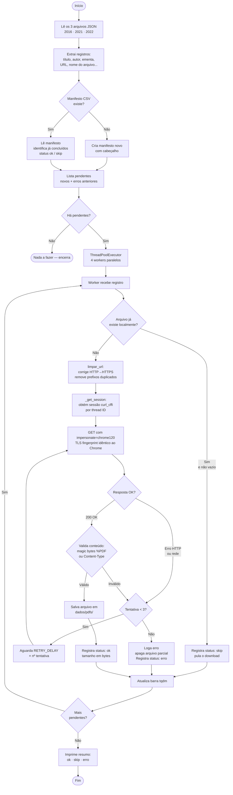

# Pipeline de Extração de PDFs — ANEEL

Script responsável por extrair metadados dos arquivos JSON da biblioteca ANEEL e baixar os PDFs correspondentes para uso em um banco vetorial (RAG/NLP).

---

## Visão Geral

A ANEEL disponibiliza documentos legislativos (Despachos, Resoluções, Portarias etc.) na URL base `https://www2.aneel.gov.br/cedoc/`. O processo foi dividido em duas etapas:

1. **Extração de metadados** — leitura dos JSONs com informações de cada documento
2. **Download dos PDFs** — requisição HTTP com bypass de TLS fingerprinting e salvamento local

---

## Fluxo de Execução



---

## Problema Central: TLS Fingerprinting

O servidor da ANEEL bloqueia clientes que não se pareçam com um navegador real. A biblioteca `requests` padrão do Python usa OpenSSL, que gera um **ClientHello TLS diferente do Chrome**. O servidor detecta isso pela assinatura JA3/JA4 e retorna **HTTP 403** — independentemente dos headers enviados.

### Solução: `curl_cffi`

```
requests (Python/OpenSSL)
  └─ TLS ClientHello → JA3 "Python"  →  servidor detecta → 403 Forbidden

curl_cffi (BoringSSL + impersonate="chrome120")
  └─ TLS ClientHello → JA3 "Chrome"  →  servidor aceita  → 200 OK
```

A biblioteca `curl_cffi` compila o libcurl contra o BoringSSL (a mesma TLS stack do Chrome) e replica os cipher suites, extensões e ordem exatos do Chrome 120, tornando o fingerprint indistinguível de um browser real.

---

## Pool de Sessões por Thread

Com múltiplos workers paralelos, cada thread precisa de sua própria sessão para evitar condições de corrida:

```python
_session_pool: dict[int, cf.Session] = {}
_pool_lock = Lock()

def _get_session() -> cf.Session:
    tid = threading.get_ident()          # ID único por thread
    with _pool_lock:
        if tid not in _session_pool:
            _session_pool[tid] = criar_sessao()   # cria uma vez por thread
    return _session_pool[tid]
```

```
Thread-1 (ID: 1234)  ──►  Session A  (Chrome120)
Thread-2 (ID: 5678)  ──►  Session B  (Chrome120)
Thread-3 (ID: 9012)  ──►  Session C  (Chrome120)
Thread-4 (ID: 3456)  ──►  Session D  (Chrome120)
```

---

## Retomada Automática (Resumable)

O manifesto CSV registra cada arquivo com seu status. Ao reexecutar o script, ele lê o manifesto e pula arquivos já concluídos:

```
pdfs_manifesto.csv
┌──────────────┬────────────────┬───────┬───────────────┬──────┐
│ arquivo      │ titulo         │ ...   │ status        │ tam. │
├──────────────┼────────────────┼───────┼───────────────┼──────┤
│ dsp2016.pdf  │ Despacho 3386  │ ...   │ ok            │ 73kb │
│ res2021.pdf  │ Resolução 001  │ ...   │ ok            │ 95kb │
│ prt2022.pdf  │ Portaria 512   │ ...   │ erro          │ 0    │
└──────────────┴────────────────┴───────┴───────────────┴──────┘

Segunda execução: apenas "prt2022.pdf" (e outros com erro) são retentados.
```

---

## Limpeza de URLs

Alguns registros JSON continham URLs malformadas:

```
"http://  http://www2.aneel.gov.br/cedoc/doc.pdf"   ← protocolo duplicado com espaços
"http://www2.aneel.gov.br/cedoc/doc.pdf"            ← HTTP ao invés de HTTPS
```

A função `limpar_url()` normaliza todos os casos para HTTPS válido.

---

## Estrutura de Arquivos

```
Projeto NLP/
├── extracao_dados/
│   ├── download_pdfs.py        ← este script
│   └── README.md               ← esta documentação
└── dados/
    ├── dados_grupo_estudos/
    │   ├── biblioteca_aneel_gov_br_legislacao_2016_metadados.json   (6.279 PDFs)
    │   ├── biblioteca_aneel_gov_br_legislacao_2021_metadados.json   (9.624 PDFs)
    │   └── biblioteca_aneel_gov_br_legislacao_2022_metadados.json   (11.136 PDFs)
    ├── pdfs/                   ← 26.993 PDFs baixados (ignorados pelo git)
    ├── pdfs_manifesto.csv      ← metadados completos + status de cada arquivo
    └── pdfs_erros.log          ← log de falhas com URL e tipo de exceção
```

---

## Como Executar

```bash
# Instalar dependências
pip install curl_cffi tqdm

# Rodar o download (retomável — pode interromper e continuar)
python extracao_dados/download_pdfs.py
```

**Resultado final (execução de 2025-04-18):**

| Status | Quantidade |
|--------|-----------|
| Baixados com sucesso | 26.993 |
| Já existiam (pulados) | 7 |
| Erros (links quebrados) | 39 |
| **Total** | **27.039** |

---

## Parâmetros Configuráveis

| Parâmetro | Valor padrão | Descrição |
|-----------|-------------|-----------|
| `MAX_WORKERS` | 4 | Threads paralelas de download |
| `TIMEOUT` | 30s | Timeout por requisição |
| `MAX_RETRIES` | 3 | Tentativas antes de marcar como erro |
| `RETRY_DELAY` | 8s | Delay base entre tentativas (multiplicado pelo nº da tentativa) |
| `REQUEST_DELAY` | 1.0s | Pausa entre downloads por worker |
